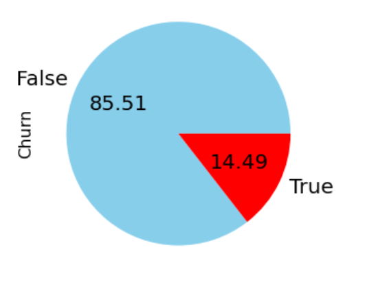

# SYRIATEL CUSTOMER CHURN
Author: Scholar Chepkirui

## Project overview
This project uses machine learning algorithms to build a model that can accurately predict customers who will churn based on the information available in the dataset. The dataset has 20 predictor variables mostly about customer usage patterns. The target variable is 'churn'. Since the target variable is a categorical variable, classification algorithms are used to build the predictive model. Recall is used to evaluate the model's performance.

## Business problem¶
For telecommunication companies to grow their revenue generating base, it is key to attract new customers and at the same time increase customer retention rate. Syriatel is a provider of mobile telecommunication and data services based in Damascus, Syria. It has established that long-term relationships with customers are more effective than trying to attract new customers. Churn prediction has therefore become a very important part of the company's strategy. This project aims to develop a model which accurately predicts customers who are most likely to churn, and identify the features that are important for predicting customer churn. Syriatel can thus act to prevent the customer who is likely to churn from actually churning.

## Exploratory data analysis
There is a class imbalance problem since the target class has an uneven distribution of observations. 85.51% of the data belongs to the False class while 14.49% belongs to the true class.

The scaling differs across the features, and a few of the features are not normally distributed. The features will therefore have to be scaled and normalized.

There is a very low correlation between most features.However, there is a perfect positive correlation between total charge and total minutes at different times. This is expected since the charge of a call depends on the length of the call in minutes. 
total day minutes, total day charge and customer service calls have a weak positive correlation with churn. The other features have a negligible correlation with churn, approximately 0.

## Data preparation for Machine Learning
- Multicollinearity of features: columns showing total charge at different times are dropped to address the multicollinearity 
- Train-test split: Data is split into train and test sets. 
- Transform categorical variables: dummy variables are created for categorical features. 
- SMOTE: SMOTE is used to handle class imbalance problems by oversampling the minority class with replacement. 
The pie chart below shows the distribution of target variable after applying SMOTE. 

## Modeling
Various models are created using logistic regression, decision tree and random forest algorithms. Hyperparameter tuning is applied to ldecision tree and random forest algorithms. 
A pipeline is used to prevent data leakage. Data is scaled in the pipeline.

## Evaluation
Recall is used as the main evaluation metric, but precision and accuracy are also considered as secondary metrics.

## Conclusion

